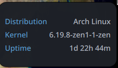

# Sys-Info Widget

A streamlined Noctalia desktop plugin that display system information.

## Features

## Installation
This plugin is part of the `noctalia-plugins` ecosystem. Clone this repo into your Noctalia plugins directory:
\`~/.config/noctalia/plugins/sys-info-widget\`

## Configuration
None

## Requirements
- **Noctalia Shell**: 3.6.0 or later.
- **System Dependencies**:

## Technical Details
- **Data Source**: Polls standard system utilities.
- **Backend**: QML integration with shell-based data collection.
